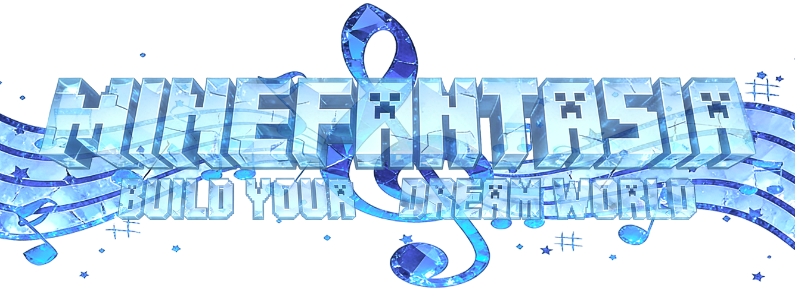

我的音乐幻想|MineFantasia
=======

  <strong>Language</strong>: <a href="README-en.md">English</a> | <a href="README.md">简体中文</a>

Introduction
=======
Welcome to MineFantasia! This is a Minecraft mod about music. 

The mod is still under development, but you can download it to experience the currently implemented features. 

The mod provided various of musical instruments such as piano, different kinds of synth, strings and woodwinds. 
Just right-click the instrument, and then you can play it with your keyboard or mouse in the open screen. 

Besides the instruments, the mod also provided a multi-player playing system which means you can play instruments with your friends and complete brilliant musical ensemble pieces. 

In addition, to accommodate instrument-playing animations, the mod uses the latest GeckoLib5 to replace all player models in all perspectives in the original Minecraft.
During your instrument performance, the model will also perform the corresponding playing actions. 

Customize Player Model
=======
To make the mod's instrument performance system more vivid, the mod incorporates an animation system based on GeckoLib5 and replaces the player model with a GeckoLib model. This also ensures that the player's first-person perspective is a true first-person view. 

The model support replacement, but ysm models or other models are <strong>not supported</strong> in this mod. You should use GeckoLib model whose bones are constructed for this mod. 

When you run the mod for the first time and enter the world, a dedicated folder for the mod will be created in your `mods` folder.  

Its file structure is: 

 Click to Expand

📁`minefantasia` 
├──📁`model` 
│ ├──📄`player.geo.json` 
├──📁`animation` 
│ ├──📄`player.animation.json` 
├──📁`texture` 
│ └──🖼️`player.png` 
└──📄`uuid.json` 

Among them, the `model` folder stores all your GeckoLib model files (`key.geo.json`),
the `animation` folder stores all your GeckoLib model animation files (`key.animation.json`), and the `texture` folder stores all your GeckoLib model textures (`key.png`). 

For each folder will create a default JSON file with key `player`, <strong>you shouldn't remove or replace them!</strong>

The `uuid.json` file is a file named after the player's `UUID`. It is generated only when the player enters the world and contains four key record fields: 

 Click to Expand

📄`uuid.json` 
├── 🗝️`key` field: must be a unique and distinct identifier used within the mod's code to register, label, and bind the corresponding player model. 
├── 🗝️`model` field: the absolute path to your custom GeckoLib player model file, without the `.geo.json` extension. 
├── 🗝️`texture` field: the absolute path to your custom player model texture, including the full filename. 
└── 🗝️`animation` field: the absolute path to your custom GeckoLib player model animation file, without the `.animation.json` extension. 

To facilitate model registration and identification within the mod, all model file names and bone names must be prefixed with your model `key`. For example: `key.geo.json`, `key.head`, and so on. 

The mod does not impose strict rules or limitations on the number of model bones or their structure. However, please ensure that your custom GeckoLib model includes the following essential bones that meet these requirements: 

 Click to Expand

📄`key.geo.json` 
├── 🦴`key.head` bone: This bone is used by the mod to calculate the camera coordinates and offsets in first-person view, as well as to locate the model's head position and compute head rotation based on the viewing angle. 
├── 🦴`key.cameraAnchor` bone: This bone <strong>must</strong> contain only one `locator` named `cameraAnchor`, and its parent must be the model's root bone (`key.root`). This bone is used by the mod to calculate the camera coordinates and offsets in first-person view. 
├── 🦴`key.rightHandItem` bone: This bone <strong>must</strong> contain only one `locator` named `rightHandItem`, and its parent <strong>must</strong> be the corresponding hand bone to allow the item to follow animations. This bone is used by the mod to calculate the rendering position and offset of the player's right-hand (main-hand) item across all perspectives. 
└── 🦴`key.leftHandItem` bone: This bone <strong>must</strong> contain only one `locator` named `leftHandItem`, and its parent <strong>must</strong> be the corresponding hand bone to allow the item to follow animations. This bone is used by the mod to calculate the rendering position and offset of the player's left-hand (off-hand) item across all perspectives. 

The mod uses the `pivot` values of the above four bones for coordinate calculations. Please ensure their pivot values are set correctly. 
For other bones, such as their child bones and naming conventions, the mod does not impose strict restrictions. 

Please note that the current player model replacement system in the mod does <strong>not</strong> automatically synchronize the models being used by each player in multiplayer mode. Model changes still require manual adjustments to the content in `uuid.json`. This means that if you wish to showcase your model to others, you must send them all the JSON files of your model and instruct them to manually modify <strong>the corresponding `uuid.json` file on their own device</strong>. 

Customize Model Animations
=======
The mod supports custom player model animations. Since all animation names are <strong>hardcoded</strong> in the mod's source code, your custom model animation names must match the hardcoded animation names. 
The currently supported animations and their naming requirements are as follows: 

 Click to Expand

📄`key.animation.json` 
├── 🎬`key.walk`：The animation played when the player model is walking. 
├── 🎬`key.idle`：The animation played when the player model is idle. 
└── 🎬`key.swim`：The animation played when the player model is swimming. 

More animations will also be supported in the future. 

Installation
=======
1.Please go to GeckoLib's [GitHub repository](https://github.com/bernie-g/geckolib), [modrinth page](https://modrinth.com/mod/geckolib), or other sources to download the corresponding version of GeckoLib-NeoForge. Then, place the downloaded JAR file into your `mods` folder. 
2.Please download the latest version of this mod from the `Releases` section on the right or from Modrinth, and place the downloaded JAR file into your `mods` folder. 

FAQ
=======
Q1.How can I obtain the instruments? 
A1.Currently, instruments are not craftable or manufacturable. In non-creative modes, the mod's piano naturally generates in the central area of the mod-added structure, the `Concert Hall`, and cannot be destroyed. Other instruments can only be obtained from the backstage chests within the Concert Hall. 

Q2.In multiplayer mode, I cannot hear the sound of other players' instrument performances. 
A2.In multiplayer mode, the instrument performance system only synchronizes performance data to players who are in the same chunk as the player currently playing an instrument. 

Q3.In first-person view, I can see through blocks. 
A3.This typically occurs when the modeler sets the `cameraAnchor` bone of the model beyond the boundary of the head bone, causing the camera's Z-axis coordinate to shift too far forward in front of the player during internal calculations by the mod. The algorithm for this aspect of the mod will be optimized in the future. Currently, this issue can be mitigated by adjusting the Z-coordinate of the `cameraAnchor` bone in the corresponding model's `key.geo.json` file. 

Q4.The size, angle, or appearance of certain items held by the player appears unusual across different perspectives. 
A4.Due to the complete replacement of the original player model system, the vanilla item rendering logic is no longer compatible with the replaced GeckoLib model. This issue is currently being adapted and improved. 

Q5.Will there be a version of the mod for Forge/Fabric in the future? 
A5.Due to limited personal development capacity, there are currently no plans to develop a Forge/Fabric version. 

Q6.Can I access the source code to add new custom features to the mod? 

A6.The mod is not open-source at this time. Thank you for your understanding! If you are interested in porting the mod to other mod loaders, please email `morinoyoake@qq.com`. 

