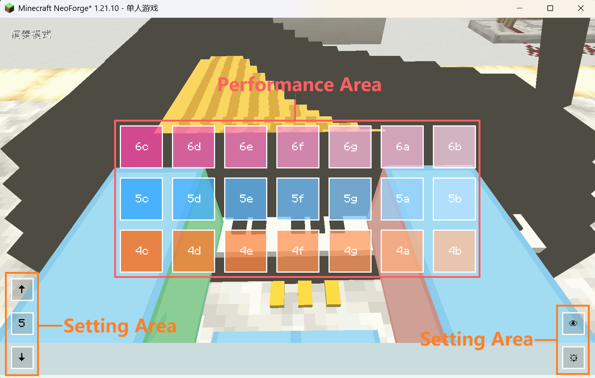

我的音乐幻想|MineFantasia
=======

  <strong>Language</strong>: <a href="README-en.md">English</a> | <a href="README.md">简体中文</a>

Introduction
=======
Welcome to MineFantasia! This is a Minecraft mod about music. 

The mod is still under development, but you can download it to experience the currently implemented features. 

The mod provided various of musical instruments such as piano, different kinds of synth, strings and woodwinds. Just right-click the instrument, and then you can play it with your keyboard or mouse in the open screen. 

Besides the instruments, the mod also provided a multi-player playing system which means you can play instruments with your friends and complete brilliant musical ensemble pieces. 

In addition, to accommodate instrument-playing animations, the mod uses the latest GeckoLib5 to replace all player models in all perspectives in the original Minecraft.
During your instrument performance, the model will also perform the corresponding playing actions. 

Instrument Performance System
=======
This mod adds a musical instrument performance system to Minecraft, along with a wide variety of instruments based on it. This also serves as the core functionality implemented by the mod.

## Instrument Performance Screen

When a player holds an instrument in their main hand or right-clicks on a placed instrument, the instrument performance screen will open:

`Performance Area`: Consists of 21 blocks arranged from top to bottom and left to right. Each block maps to the keyboard keys Q–U, A–J, Z–M, with the name of the corresponding note displayed in the middle of the current block.

`Setting Area`: Contains 5 function buttons, with three located in the bottom-left corner and two in the bottom-right corner.

## Bottom-left corner of the screen:

There are three buttons, arranged from top to bottom: `Raise Button`, `Current Central Octave Number` / `Number of Semitones Raised`, and `Lower Button`.

When the middle button displays no `+` or `-` sign, it shows the `Current Central Octave Number`; when it displays a `+` or `-` sign, it shows the `Number of Semitones Raised`. The two values are recorded independently yet interact with each other. Within a single performance session, each value is tracked separately and will not be reset when switching between displays.

When in the mode displaying `Central Octave Number`, clicking the `raise/lower button` will shift all 21 notes in the `Performance Area` up or down by one `octave` (i.e., 12 semitones). When in the mode displaying `Number of Semitones Raised`, clicking the `raise/lower button` will shift all 21 notes up or down by one `semitone`. All changes will be reflected in the blocks of the performance area.

It is important to note that in the `Central Octave Number` mode, the pitch raise/lower range will not exceed or fall below the highest octave number supported by the instrument. In the `Number of Semitones Raised` mode, however, the upper and lower limits are expanded by one octave to ensure full coverage of all notes.

These three buttons are bound to the arrow keys on the keyboard. The Up key serves as the `Raise Button`, the Down key serves as the `Lower Button`, the Right key switches from `Current Central Octave Number` to `Number of Semitones Raised`, and the Left key switches from `Number of Semitones Raised` to `Current Central Octave Number`.

## Bottom-right corner of the screen:

There are two buttons, arranged from top to bottom: `Hide Performance Blocks Button` (featuring an eye icon) and `Settings Button` (featuring a gear icon).

When the `Hide Performance Blocks Button` is clicked, the 21 blocks in the `Performance Area` and the `Settings Button` will be hidden, and the performance screen background will become fully transparent. Clicking again will restore them.

When the `Settings Button` is clicked, the screen enters `Note Edit Mode`. You can select a block to modify its note name using the keyboard or mouse, enter the new note name in the input field below, and press `Enter` to confirm the change.

## Note Configuration

Due to limitations of the vanilla Minecraft registration system, the naming convention for notes follows the format: `Octave Number (octave position) + Note Name`.

The `Octave Number` follows the numbering used in the FL Studio piano roll. Note names are in lowercase letters, with `s` used before the note name to represent a sharp (`#`). For example: `5c`, `6sc`, etc. The mod does not include flat notes.

File System And Customize Player Model
=======
To make the mod's instrument performance system more vivid, the mod incorporates an animation system based on GeckoLib5 and replaces the player model with a GeckoLib model. This also ensures that the player's first-person perspective is a true first-person view. 

The model support replacement, but ysm models or other models are <strong>not supported</strong> in this mod. You should use GeckoLib model whose bones are constructed for this mod. 

When you run the mod for the first time and enter the world, a dedicated folder for the mod will be created in your `mods` folder.  

Its file structure is: 

 Click to Expand

📁`minefantasia` 
├──📁`midi` 
├──📁`model` 
│ ├──📄`player.geo.json` 
├──📁`animation` 
│ ├──📄`player.animation.json` 
├──📁`texture` 
│ └──🖼️`player.png` 
└──📄`uuid.json` 

Among them, the `midi` folder stores all your MIDI files (unrelated to model replacement), the `model` folder stores all your GeckoLib model files (`key.geo.json`),
the `animation` folder stores all your GeckoLib model animation files (`key.animation.json`), and the `texture` folder stores all your GeckoLib model textures (`key.png`). 

For each folder will create a default JSON file with key `player`, <strong>you shouldn't remove or replace them!</strong>

The `uuid.json` file is a file named after the player's `UUID`. It is generated only when the player enters the world and contains four key record fields: 

 Click to Expand

📄`uuid.json` 
├── 🗝️`key` field: must be a unique and distinct identifier used within the mod's code to register, label, and bind the corresponding player model. 
├── 🗝️`model` field: the absolute path to your custom GeckoLib player model file, without the `.geo.json` extension. 
├── 🗝️`texture` field: the absolute path to your custom player model texture, including the full filename. 
└── 🗝️`animation` field: the absolute path to your custom GeckoLib player model animation file, without the `.animation.json` extension. 

To facilitate model registration and identification within the mod, all model file names and bone names must be prefixed with your model `key`. For example: `key.geo.json`, `key.head`, and so on. 

The mod does not impose strict rules or limitations on the number of model bones or their structure. However, please ensure that your custom GeckoLib model includes the following essential bones that meet these requirements: 

 Click to Expand

📄`key.geo.json` 
├── 🦴`key.head` bone: This bone is used by the mod to calculate the camera coordinates and offsets in first-person view, as well as to locate the model's head position and compute head rotation based on the viewing angle. 
├── 🦴`key.cameraAnchor` bone: This bone <strong>must</strong> contain only one `locator` named `cameraAnchor`, and its parent must be the model's root bone (`key.root`). This bone is used by the mod to calculate the camera coordinates and offsets in first-person view. 
├── 🦴`key.rightHandItem` bone: This bone <strong>must</strong> contain only one `locator` named `rightHandItem`, and its parent <strong>must</strong> be the corresponding hand bone to allow the item to follow animations. This bone is used by the mod to calculate the rendering position and offset of the player's right-hand (main-hand) item across all perspectives. 
└── 🦴`key.leftHandItem` bone: This bone <strong>must</strong> contain only one `locator` named `leftHandItem`, and its parent <strong>must</strong> be the corresponding hand bone to allow the item to follow animations. This bone is used by the mod to calculate the rendering position and offset of the player's left-hand (off-hand) item across all perspectives. 

The mod uses the `pivot` values of the above four bones for coordinate calculations. Please ensure their pivot values are set correctly. 
For other bones, such as their child bones and naming conventions, the mod does not impose strict restrictions. 

Please note that the current player model replacement system in the mod does <strong>not</strong> automatically synchronize the models being used by each player in multiplayer mode. Model changes still require manual adjustments to the content in `uuid.json`. This means that if you wish to showcase your model to others, you must send them all the JSON files of your model and instruct them to manually modify <strong>the corresponding `uuid.json` file on their own device</strong>. 

Customize Model Animations
=======
The mod supports custom player model animations. Since all animation names are <strong>hardcoded</strong> in the mod's source code, your custom model animation names must match the hardcoded animation names. 
The currently supported animations and their naming requirements are as follows: 

 Click to Expand

📄`key.animation.json` 
├── 🎬`key.walk`：The animation played when the player model is walking. 
├── 🎬`key.idle`：The animation played when the player model is idle. 
├── 🎬`key.crouch`：The animation played when the player model is sneaking. 
├── 🎬`key.swim`：The animation played when the player model is swimming. When this animation is active, the player's held item is not displayed. Since vanilla Minecraft changes the player's collision box to `0.6x0.6x0.6` in this state, to ensure the player model's head rotates correctly and the camera coordinates are properly applied, follow these steps when creating this animation: after completing the overall model animation, navigate to the `Animations` page in BlockBench and adjust the entire model by moving the `key.root` bone so that the `pivot` of the head bone `key.head` aligns with the coordinate `[0, 6.4, 0]`. Additionally, ensure that the `key.root` bone has **no** `Rotation` offset. 
├── 🎬`key.fly`：The animation played when the player model is flying with an elytra. When this animation is active, the player's held item is not displayed. Since vanilla Minecraft changes the player's collision box to `0.6x0.6x0.6` in this state, to ensure the player model's head rotates correctly and the camera coordinates are properly applied, follow these steps when creating this animation: after completing the overall model animation, navigate to the `Animations` page in BlockBench and adjust the entire model by moving the `key.root` bone so that the `pivot` of the head bone `key.head` aligns with the coordinate `[0, 6.4, 0]`. Additionally, ensure that the `key.root` bone has **no** `Rotation` offset. 
├── 🎬`key.piano`：The overall animation played when the player model is performing using a piano, such as changes in posture. 
├── 🎬`key.kalimba`：The overall animation played when the player model is performing using a kalimba, such as changes in posture. 
├── 🎬`key.harp`：The overall animation played when the player model is performing using a harp, such as changes in posture. 
├── 🎬`key.violin`：The overall animation played when the player model is performing using a violin, such as changes in posture. 
├── 🎬`key.synth`：The overall animation played when the player model is performing using any type of synthesizer, such as changes in posture. 
├── 🎬`key.pianoPlay`：The instantaneous animation triggered when the player model presses a note while performing on a piano with the performance interface open, such as hand movements. 
├── 🎬`key.kalimbaPlay`：The instantaneous animation triggered when the player model presses a note while performing on a kalimba with the performance interface open, such as hand movements. 
├── 🎬`key.harpPlay`：The instantaneous animation triggered when the player model presses a note while performing on a harp with the performance interface open, such as hand movements. 
├── 🎬`key.violinPlay`：The instantaneous animation triggered when the player model presses a note while performing on a violin with the performance interface open, such as hand movements. 
├── 🎬`key.synthPlay`：The instantaneous animation triggered when the player model presses a note while performing on a synth with the performance interface open, such as hand movements. 
└──

Additional Note: 

The reason why the `Rotation` of the `key.root` bone must not be modified for the `key.swim` and `key.fly` animations is that, in practice, adding a rotation offset to the model's root bone can cause GeckoLib's calculations for rotating the player's head bone according to the camera perspective to become inaccurate or even fail. The exact cause is currently unclear, so for now, it is necessary to avoid directly modifying the root bone's rotation offset during animation creation.

Due to limited artistic expertise, the default model does not include performance animations for certain instruments, nor has it been thoroughly tested and verified. However, the mod still retains the relevant calls for these animations. You can use the animation names mentioned above in your custom models to add animations for the corresponding instruments. If any issues arise, please feel free to submit an issue on the mod's [GitHub repository issues page](https://github.com/Seikai-Takenawa/MineFantasia/issues).

MIDI System
=======
The mod implements reading local MIDI files and can play them using the mod's built-in instrument sounds.

All MIDI files are stored in the `mods/minefantasia/midi` folder:

 Click to Expand

📁`minefantasia` 
└──📁`midi` 

MIDI files must have the `.mid` extension. The mod supports single-track and multi-track playback for `format0` and `format1` MIDI files, and single-track playback for `format2` MIDI files.

## MIDI Player and Its Screen

In the mod, MIDI file playback is implemented through the mod's block entity: the MIDI Player. Its screen is shown in the following figure:

The MIDI Player screen has three selection panels, from left to right:

### Instruments

This panel displays all instruments from the mod by default. Here, you can select the mod instrument to be used for playing the track. Only one instrument can be selected at a time in this panel.

### MIDI Files

This panel automatically reads and displays the names of all MIDI files stored in the `mods/minefantasia/midi` folder. Here, you can select the MIDI file to be played. Once selected, the mod will automatically parse the MIDI file and display all its tracks sequentially in the `Tracks` panel. Only one MIDI file can be selected at a time in this panel.

### Tracks

Once you have selected a MIDI file, this panel will read the selected MIDI file and display all its tracks sequentially. Here, you can select multiple tracks at once.

Below each panel, there are page-turning buttons indicated by left and right arrows. The default number of entries displayed per panel is 5.

Additionally, the MIDI player screen features three buttons, arranged from left to right as follows:

### Confirmed
This button is specifically used for configuring settings before triggering with a redstone signal, such as selecting the instrument and tracks to play. When not playing, clicking this button will not start playback of the selected tracks. To play, you must trigger it with a redstone signal. If clicked while playback is in progress, the system will check whether the selected instrument or other options have changed. If changes are detected, playback will stop and immediately restart using the new configuration.

### Play
This button is used to immediately play the selected tracks after choosing the instrument and tracks.

Please note: If you click play without selecting any instrument or track, the MIDI player will leave the relevant information empty.

### Stop
This button is used to immediately stop playback on the current MIDI player and clear the previous playback information, such as the selected instrument and tracks. If this button is not clicked, the information will not be lost after the MIDI sequence finishes playing normally. Once this button is clicked, the MIDI player must be reconfigured.

In the top-left corner of the interface, there are two additional buttons, arranged from top to bottom:

### Network Sync Playback Button
When this button is activated, it will turn green and broadcast the currently playing MIDI file to all players on the server. This synchronization feature is independent for each client. This means that even if other players do not have the MIDI file you are using, they will still be able to hear the music. This button can be adjusted at any time during playback.

### Stop Control Button
This button is red by default, indicating that the current MIDI player block entity is occupied by you. Clicking this button will release your occupancy of the block entity and close the playback screen, allowing other players to right-click and open the screen to use the player.

## The Controls of MIDI Player

The MIDI player supports redstone control. Like ordinary blocks, it can transmit redstone signals, but it is not a redstone component itself.

The MIDI player accepts redstone pulse signals. Upon receiving a pulse signal, it toggles its playback state.

In multiplayer mode, a single MIDI player shares a single entity across the entire server. To prevent conflicts between different clients, the MIDI player implements player binding. Upon initial placement, the player who first opens the playback screen will be automatically bound to the MIDI player.
Until this player actively releases the binding or the block is broken and replaced, other players on the server cannot open the playback screen by right-clicking, though they can still control the MIDI player's playback state via redstone.

Installation
=======
1.Please go to GeckoLib's [GitHub repository](https://github.com/bernie-g/geckolib), [modrinth page](https://modrinth.com/mod/geckolib), or other sources to download the corresponding version of GeckoLib-NeoForge. Then, place the downloaded JAR file into your `mods` folder. 
2.Please download the latest version of this mod from the `Releases` section on the right or from Modrinth, and place the downloaded JAR file into your `mods` folder. 

FAQ
=======
Q1.How can I obtain the instruments? 
A1.Currently, instruments are not craftable or manufacturable. In non-creative modes, the mod's piano naturally generates in the central area of the mod-added structure, the `Concert Hall`, and cannot be destroyed. Other instruments can only be obtained from the backstage chests within the Concert Hall. 

Q2.In multiplayer mode, I cannot hear the sound of other players' instrument performances. 
A2.In multiplayer mode, the instrument performance system only synchronizes performance data to players who are in the same chunk as the player currently playing an instrument. 

Q3.In first-person view, I can see through blocks. 
A3.The mod has refactored the camera follow system for the first-person perspective. The camera is now always positioned at the `cameraAnchor` of the player model's head. As a result, when the player looks downward while standing close to a block, the camera position may extend beyond the player's collision box, potentially causing clipping issues. Additionally, incorrect configuration of the `pivot` of the `cameraAnchor` bone by the modeler may also cause the camera coordinates to exceed the collision box. Currently, there is no better solution for this issue. It is recommended that custom player models have a smaller head design and that the `pivot` of both the head and `cameraAnchor` bones be adjusted to appropriate positions to prevent the head from moving outside the collision box.

Q4.The size, angle, or appearance of certain items held by the player appears unusual across different perspectives. 
A4.Due to the complete replacement of the original player model system, the vanilla item rendering logic is no longer compatible with the replaced GeckoLib model. This issue is currently being adapted and improved. 

Q5.MIDI player speed is incorrect / stuttering / running too fast.
A5.Since the mod uses Minecraft's built-in tick system for timing, its accuracy is affected by fluctuations in the tick rate of the server/client.

Q6.Will there be a version of the mod for Forge/Fabric in the future? 
A6.Due to limited personal development capacity, there are currently no plans to develop a Forge/Fabric version. 

Q7.Can I access the source code to add new custom features to the mod? 
A7.The mod is not open-source at this time. Thank you for your understanding! 
