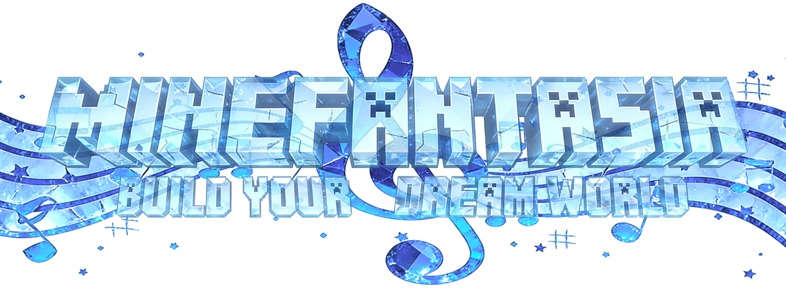
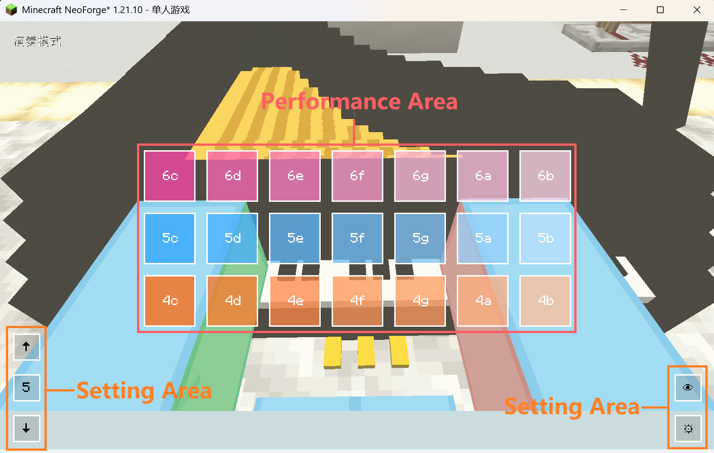
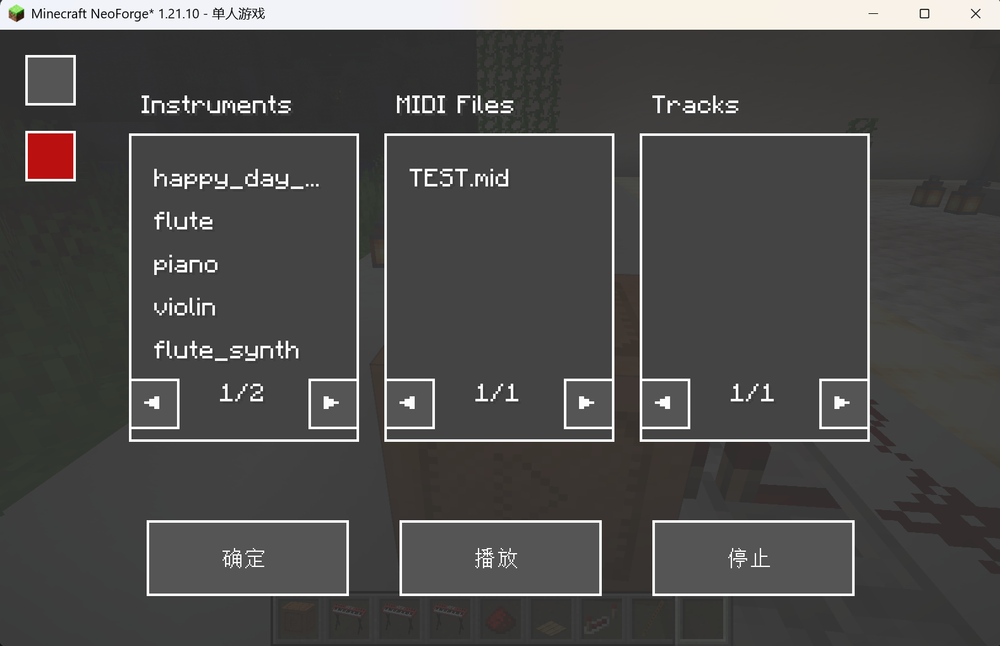

我的音乐幻想|MineFantasia
=======

<p align="center">
  <strong>Language</strong>: <a href="README-en.md">English</a> | <a href="README.md">简体中文</a>
</p>


Introduction
=======
Welcome to MineFantasia! This is a music mod for Minecraft.

The mod is currently still in development, but you can download it to experience the features that have been implemented so far.

The mod provides various instruments such as pianos, synthesizers, string instruments, and wind instruments. Simply right-click the corresponding instrument to open a new interface where you can start playing using your keyboard or mouse.

In addition to instruments, the mod also provides a multiplayer ensemble system. This means you can perform a magnificent instrumental ensemble with your friends.

Instrument Performance System
=======
The mod adds an instrument performance system to Minecraft, and based on this, adds a wide variety of instruments. This is the core functionality of the mod.

## Instrument Performance Interface

When a player holds an instrument in their main hand or right-clicks on a placed instrument, the instrument performance interface will open:



`Performance Area`: Contains 21 blocks, from top to bottom, left to right. Each block corresponds to the keyboard keys Q-U, A-J, Z-M, with the name of the corresponding note displayed in the middle of the block.

`Settings Area`: Contains 5 function buttons, three in the lower-left corner and two in the lower-right corner.

### Lower-Left Corner of the Interface:

There are 3 buttons, from top to bottom: `Raise Button`, `Current Center Octave Number`/`Number of Raised Semitones`, `Lower Button`.

When the middle button shows no `+` or `-` sign, it displays the `Current Center Octave Number`. When it shows `+` or `-`, it displays the `Number of Raised Semitones`. The records for both are independent but interact with each other. Within a single performance session, they only record their respective data separately but will not reset upon switching.

When you click the `Raise/Lower Button` while in `Center Octave Number` mode, all 21 notes in the `Performance Area` will be raised/lowered by one `octave` (12 semitones). When in `Number of Raised Semitones` mode, clicking the `Raise/Lower Button` will raise/lower all 21 notes by one `semi-tone`. All changes will be displayed in the performance area blocks.

Note: In `Center Octave Number` mode, the pitch raise/lower range will not exceed/go below the instrument's recorded highest/lowest octave number. In `Number of Raised Semitones` mode, to ensure coverage of all notes, the upper and lower limits are expanded by one octave group.

These three buttons are bound to the arrow keys on the keyboard. Up is `Raise Button`, Down is `Lower Button`, Right switches from `Current Center Octave Number` to `Number of Raised Semitones`, Left switches from `Number of Raised Semitones` to `Current Center Octave Number`.

### Lower-Right Corner of the Interface:

There are 2 buttons, from top to bottom: `Hide Performance Blocks Button` (featuring an eye icon) and `Settings Button` (featuring a gear icon).

Clicking the `Hide Performance Blocks Button` will hide the 21 blocks in the `Performance Area` and the `Settings Button`, making the performance interface background fully transparent. Clicking again will restore them.

Clicking the `Settings Button` enters `Note Edit Mode`. You can select a block whose note name needs changing via keyboard or mouse, enter the new note name in the input field below, and press `Enter` to complete the modification.

## Note Configuration

Due to limitations of the vanilla Minecraft registration system, the naming rule for note names is: `Octave Group Number (octave position) + Note Name`.

The `Octave Group Number` refers to the numbering used in FL Studio's piano roll. Note names are all lowercase letters, with `s` preceding the note name to represent `#` (sharp). For example: `5c`, `6sc`. The mod does not introduce flat notes.

The mod divides notes into Staccato and Sustained notes. Currently, Staccato instruments include: Piano, Kalimba, Harp. Sustained instruments include: all Synthesizers, Violin, Flute.

The playing principle for Staccato instruments is: when a note is clicked, the corresponding sound plays once. If you long-press a note in the performance interface, the corresponding note will repeat rapidly. Furthermore, if you replace the piano sound source using a resource pack, please ensure that the length of each individual piano sound does not exceed the original sound source's length. Otherwise, it may cause disastrous consequences!

For Sustained instruments: The maximum duration a single note can be played is determined by the length of the sound source file. The mod's default sustained sounds can last up to 8 seconds (the length of 4 measures at 120 BPM in FL Studio).

File System
=======
After you run the mod for the first time and enter a world, the mod will generate its dedicated folder inside your `mods` folder.

Its file structure is:<br>
<details style="background-color: #a9a9a933; border-radius: 8px; padding: 15px; border: 1px solid #e1e4e8;">
<summary style="cursor: pointer; font-weight: bold; color: #ffffffcc; font-size: 1.1em;">
 Click to expand
</summary>

```
📁`minefantasia`
├── 📁`midi`
├── 📁`ins`
│   └── 📁`custom_synth`
│       └── 📄`example.json`
├── 📁`model`
│   └── 📄`player.geo.json`
├── 📁`animation`
│   └── 📄`player.animation.json`
├── 📁`texture`
│   └── 🖼️`player.png`
└── 📄`uuid.json`

```

</details>

Here, the `midi` folder stores all your MIDI files (unrelated to model replacement), the `ins` folder stores the JSON information files for child instruments of all General Instruments, the `model` folder stores all your GeckoLib model files `key.geo.json`, the `animation` folder stores all your GeckoLib model animation files `key.animation.json`, and the `texture` folder stores all your GeckoLib model textures `key.png`.

Except for the `midi` and `ins` folders, a default JSON file with `player` as the `key` will be generated in each directory. You should not remove or replace them.

Custom General Instruments
=======
Starting from version `0.0.9-beta`, the mod will gradually add `General Instrument` versions for various instruments.

`General Instruments` allow players to add different timbres of the same instrument type themselves. Their performance interface is largely consistent with the built-in instruments, only adding a child instrument switching module above the performance area.

General Instruments operate on the model of `Mod reads basic info and completes registration + Player imports sound source resource pack`. Information related to registration is placed in the mod folder: `mods/minefantasia/ins`, subdivided by each general instrument within this folder.

Their file structure is:
<details style="background-color: #a9a9a933; border-radius: 8px; padding: 15px; border: 1px solid #e1e4e8;">
<summary style="cursor: pointer; font-weight: bold; color: #ffffffcc; font-size: 1.1em;">
 Click to expand
</summary>

```
📁`minefantasia`
└── 📁`ins`
    ├── 📁`General Instrument 1`
    │   ├── 📄`Sub Instrument 1.json`
    │   ├── 📄`Sub Instrument 2.json`
    │   └── ...
    ├── 📁`General Instrument 2`
    │   ├── 📄`Sub Instrument 1.json`
    │   ├── 📄`Sub Instrument 2.json`
    │   └── ...
    └── ...

```


</details>

The naming of the child instrument's JSON file must not conflict with existing mod instruments. For example, for the General Synthesizer, if there is a child instrument named `sunshine`, its JSON file should be named `sunshine.json` and placed in the `ins/custom_synth` folder.

The information contained is as follows:
<details style="background-color: #a9a9a933; border-radius: 8px; padding: 15px; border: 1px solid #e1e4e8;">
<summary style="cursor: pointer; font-weight: bold; color: #ffffffcc; font-size: 1.1em;">
 Click to expand
</summary>

```
📄`uuid.json`<br>
├── 🗝️`name` field: The name of the child instrument, used for internal game identification.
├── 🗝️`minOctave` field: The lowest octave of the child instrument, should be greater than 0.
├── 🗝️`maxOctave` field: The highest octave of the child instrument, should be less than 10.
└── 🗝️`fadeDuration` field: Only valid for sustained instruments, defines the time from when a key is released until the sound completely fades out.

```
</details>

General instruments currently added are as follows:
<details style="background-color: #a9a9a933; border-radius: 8px; padding: 15px; border: 1px solid #e1e4e8;">
<summary style="cursor: pointer; font-weight: bold; color: #ffffffcc; font-size: 1.1em;">
 Click to expand
</summary>

🎵-General Synthesizer

</details>

More general instruments will be adapted in the future.

To facilitate players adding resources for General Instruments, the mod tool MFPackager has been launched on GitHub. This tool can automatically package resources in a specified path into a resource pack recognizable by the mod and automatically generate the registration JSON files for child instruments.

Custom Player Model
=======
To make the mod's instrument performance system more vivid and to适配 instrument performance animations, the mod adds an animation system based on GeckoLib 5, and based on the latest GeckoLib 5, replaces the vanilla Minecraft player model for all perspectives. While you are playing an instrument, the model will also perform corresponding playing actions.

The mod also redesigns a camera following system for the first-person perspective. Although the performance of this system still needs improvement during rapid left/right view movement and in very few specific states, in most cases, this system achieves a true player first-person perspective and maintains good operation.

Model replacement is supported, but YSM models or models from other mods are _not supported_ in this mod. You should use GeckoLib models.

The `model`, `animation`, `texture` folders and `uuid.json` under the mod folder are related to custom player models.

The `uuid.json` file is a file named after the player's UUID, generated only when the player enters the world. Its content contains four key record fields:<br>
<details style="background-color: #a9a9a933; border-radius: 8px; padding: 15px; border: 1px solid #e1e4e8;">
<summary style="cursor: pointer; font-weight: bold; color: #ffffffcc; font-size: 1.1em;">
 Click to expand
</summary>

📄`uuid.json`<br>
├── 🗝️`key` field: The keyword for the model used by the player, used for registration, tagging, and binding the corresponding player model ID within the mod code. Different players can use the same key.<br>
├── 🗝️`model` field: The absolute path to the custom GeckoLib player model file. The `.geo.json` suffix is **not required**.<br>
├── 🗝️`texture` field: The absolute path to the custom player GeckoLib model texture, requires the full file name.<br>
└── 🗝️`animation` field: The absolute path to the custom GeckoLib player model animation file. The `.animation.json` suffix is **not required**.<br>

</details>

To facilitate internal model registration and differentiation within the mod, all model file names and bones need your model's `key` as a prefix, e.g., `key.geo.json`, `key.head`, etc.

The mod does not have strictly specific regulations or restrictions on the number of model bones or their structure, but please ensure your custom GeckoLib model contains the following important bones as required:<br>
<details style="background-color: #a9a9a933; border-radius: 8px; padding: 15px; border: 1px solid #e1e4e8;">
<summary style="cursor: pointer; font-weight: bold; color: #ffffffcc; font-size: 1.1em;">
 Click to expand
</summary>

📄`key.geo.json`<br>
├── 🦴`key.head` bone: This bone is used internally by the mod to calculate the camera's coordinates and offset in first-person view; it also positions the model's head and allows it to rotate with the camera.<br>
├── 🦴`key.cameraAnchor` bone: This bone must only contain a `locator`, and the locator's name **must** be `cameraAnchor`. Its parent is recommended to be the model's root bone (`key.root`) or the head bone (`key.head`). This bone is used by the mod to calculate the camera's coordinates and offset in first-person view.<br>
├── 🦴`key.rightHandItem` bone: This bone must only contain a `locator`, and the locator's name **must** be `rightHandItem`. Its parent must be the corresponding hand bone to allow the item to move with the animation. This bone is used internally by the mod to calculate the rendering position and offset of the player's right hand (main hand) item in all views.<br>
└── 🦴`key.leftHandItem` bone: This bone must only contain a `locator`, and the locator's name **must** be `leftHandItem`. Its parent must be the corresponding hand bone to allow the item to move with the animation. This bone is used internally by the mod to calculate the rendering position and offset of the player's left hand (offhand) item in all views.<br>

</details>

The mod uses the `pivot` of the above 4 bones for coordinate calculations, please ensure their pivot values are correct.<br>
For other bones besides these 4, their child bones, and element names within bones, the mod does not have strict restrictions.

Please note that the mod's current player model replacement system does not automatically synchronize the models being used by individual players in multiplayer, and still requires manual adjustment of the content in `uuid.json` to change the model. This means if you want to show your model to others, you need to send all JSON files of your model to them and ask them to manually modify your corresponding `uuid.json` on **their device**.

Custom Model Animations
=======
The mod supports custom player model animations. Since all animation names are hardcoded in the mod's code, your custom model animation names must be the same as the animation names hardcoded in the mod.<br>
Currently supported animations and their naming requirements are as follows:<br>
<details style="background-color: #a9a9a933; border-radius: 8px; padding: 15px; border: 1px solid #e1e4e8;">
<summary style="cursor: pointer; font-weight: bold; color: #ffffffcc; font-size: 1.1em;">
 Click to expand
</summary>

📄`key.animation.json`<br>
├── 🎬`key.walk`: Animation played when the player model is walking.<br>
├── 🎬`key.idle`: Animation played when the player model is idle.<br>
├── 🎬`key.crouch`: Animation played when the player model is crouching.<br>
├── 🎬`key.swim`: Animation played when the player model is swimming. Held items are not displayed when this animation plays. Since vanilla Minecraft changes the player's collision box size to `0.6x0.6x0.6` in this situation, to allow the player model's head to rotate normally and correctly apply camera coordinates, when creating this animation, after completing the overall model animation, move the entire model (`key.root`) within BlockBench's `Animation` tab to align the `pivot` of the head bone `key.head` to coordinates `[0, 6.4, 0]`, and ensure the `key.root` bone has **no** `Rotation` offset.<br>
├── 🎬`key.fly`: Animation played when the player model is flying with an elytra. Held items are not displayed when this animation plays. Since vanilla Minecraft changes the player's collision box size to `0.6x0.6x0.6` in this situation, to allow the player model's head to rotate normally and correctly apply camera coordinates, when creating this animation, after completing the overall model animation, move the entire model (`key.root`) within BlockBench's `Animation` tab to align the `pivot` of the head bone `key.head` to coordinates `[0, 6.4, 0]`, and ensure the `key.root` bone has **no** `Rotation` offset.<br>
├── 🎬`key.piano`: Overall animation played when the player model is performing on the piano, such as posture changes.<br>
├── 🎬`key.kalimba`: Overall animation played when the player model is performing on the kalimba, such as posture changes.<br>
├── 🎬`key.harp`: Overall animation played when the player model is performing on the harp, such as posture changes.<br>
├── 🎬`key.violin`: Overall animation played when the player model is performing on the violin, such as posture changes.<br>
├── 🎬`key.synth`: Overall animation played when the player model is performing on all types of synthesizers, such as posture changes.<br>
├── 🎬`key.banjo`: Overall animation played when the player model is performing on the banjo, such as posture changes.<br>
├── 🎬`key.drumKit`: Overall animation played when the player model is performing on the drum kit, such as posture changes.<br>
├── 🎬`key.bass`: Overall animation played when the player model is performing on the bass, such as posture changes.<br>
├── 🎬`key.guitar`: Overall animation played when the player model is performing on the guitar, such as posture changes.<br>
├── 🎬`key.pianoPlay`: Instant animation triggered when a note is pressed while performing on the piano with the performance interface open, such as hand movements.<br>
├── 🎬`key.kalimbaPlay`: Instant animation triggered when a note is pressed while performing on the kalimba with the performance interface open, such as hand movements.<br>
├── 🎬`key.harpPlay`: Instant animation triggered when a note is pressed while performing on the harp with the performance interface open, such as hand movements.<br>
├── 🎬`key.violinPlay`: Instant animation triggered when a note is pressed while performing on the violin with the performance interface open, such as hand movements.<br>
├── 🎬`key.synthPlay`: Instant animation triggered when a note is pressed while performing on the synthesizer with the performance interface open, such as hand movements.<br>
├── 🎬`key.banjoPlay`: Instant animation triggered when a note is pressed while performing on the banjo with the performance interface open, such as hand movements.<br>
├── 🎬`key.drumKitPlay`: Instant animation triggered when a note is pressed while performing on the drum kit with the performance interface open, such as hand movements.<br>
├── 🎬`key.bassPlay`: Instant animation triggered when a note is pressed while performing on the bass with the performance interface open, such as hand movements.<br>
└── 🎬`key.guitarPlay`: Instant animation triggered when a note is pressed while performing on the guitar with the performance interface open, such as hand movements.<br>

</details>

Additional note regarding the reason why the `Rotation` offset of the `key.root` bone cannot be modified for the `key.swim` and `key.fly` animations: In practice, if a rotational offset based on the model's root bone is added, GeckoLib's rotational calculations for the player's head bone following the camera perspective may deviate or even fail. The exact reason is currently unclear, so for now, we can only avoid directly modifying the root bone's rotational offset during animation production.

Due to limited personal artistic ability, the default model does not have performance animations for certain instruments, and thus hasn't been thoroughly tested and verified. However, the mod still retains the calls for these animations. You can use the animation names mentioned above in your custom model to add replacement animations for performing the corresponding instruments. If any issues arise, you can post an issue on this mod's [GitHub repository issues page](https://github.com/Seikai-Takenawa/MineFantasia/issues).

MIDI System
=======
The mod implements reading local MIDI files and can play them using the mod's internal instrument sounds.

All MIDI files are stored in the `mods/minefantasia/midi` folder:<br>

<details style="background-color: #a9a9a933; border-radius: 8px; padding: 15px; border: 1px solid #e1e4e8;">
<summary style="cursor: pointer; font-weight: bold; color: #ffffffcc; font-size: 1.1em;">
 Click to expand
</summary>

📁`minefantasia`<br>
└──📁`midi`<br>

</details>

The suffix for MIDI files must be `.mid`. The mod supports single-track and multi-track simultaneous playback for `format0` and `format1` MIDI files, and single-track playback for `format2` MIDI files.

## MIDI Playbox and its Interface

In the mod, MIDI file playback is achieved through the mod's block entity: the MIDI Playbox. Its interface is shown below:



The MIDI Playbox interface has three selection sections, from left to right:

### Instruments

This section will display all instruments from the mod by default. In this section, you can select the mod instrument to be used for playing the track. Only one instrument can be selected at a time in this section.

### MIDI Files

This section automatically reads the names of all MIDI files stored in your `mods/minefantasia/midi` folder and displays them. In this section, you can select the MIDI file to be played. After selection, the mod automatically parses the MIDI file and displays all tracks of the MIDI file in the `Tracks` section in sequence. Only one MIDI file can be selected at a time in this section.

### Tracks

After you select a MIDI file, this section reads the selected MIDI file and displays all tracks within it in sequence. In this section, you can select multiple tracks at once.

Below each section, there are page-turning buttons indicated by left and right arrows. The default number of information entries displayed per section is 5.

Additionally, the MIDI Playbox interface has three buttons, from left to right:

### Confirm
This button is specifically used for setting information before redstone signal triggering, such as setting the performance instrument and performance tracks. If clicked while not playing, it will not play the selected tracks. To play, you can use a redstone signal trigger. If clicked while playing, the system will check if options like the instrument selection have changed. If they have, it will stop playback and immediately start playing with the new configuration.

### Play
This button is used to immediately play the selected tracks after selecting the performance instrument and tracks.

Please note: If you click Play without selecting any instrument or track, the MIDI Playbox will set the relevant information to empty.

### Stop
This button is used to immediately stop the current MIDI Playbox playback and clear previous playback information such as the performance instrument and tracks. If you do not click this button, the information will not be lost after the MIDI sequence finishes playing normally. After clicking this button, you need to reconfigure the MIDI Playbox.

There are also two buttons in the upper-left corner of the interface, from top to bottom:

### Network Sync Play Button
When this button is activated, it turns green and will play the currently playing MIDI file to all players on the server. This sync function is independent on each client. This means that even if other players do not have the MIDI file you are playing, they can still hear the music. This button can be adjusted at any time during playback.

### Release Control Button
This button is red by default, indicating that the current Playbox entity is occupied by you. Clicking this button releases your ownership of the Playbox entity, the playback interface will close, and other players can then right-click to open the interface and use the Playbox.

## MIDI Playbox Control

The MIDI Playbox supports redstone control. Like normal blocks, it can transmit redstone signals, but it is not a redstone component itself.

The MIDI Playbox receives redstone pulse signals. Upon receiving one pulse signal, it will toggle its playback state once.

A single MIDI Playbox shares a single entity for the entire server in multiplayer mode. To avoid usage conflicts between different clients, the MIDI Playbox implements player binding. After being placed for the first time, it automatically binds the player who first opens the playback interface. Before this player actively releases it or the block is broken and replaced, other players on the server cannot right-click to open the playback interface, but they can still control the Playbox's playback state via redstone.

Custom Sound Source Resource Pack
=======
If you don't like the default sound source of a particular instrument in the mod, and you have the means and ability to obtain sound sources (e.g., sampling instruments yourself), you can replace the sound source files in the relevant resource pack yourself.

The mod's sound sources use the Ogg format. The requirements for Ogg files (such as note duration, note naming format, etc.) have been detailed in the [Note Configuration](#note-configuration) section above and will not be repeated here.

Installation
=======
The mod provides two installation versions: Full version and Lightweight version.

Full version: Contains all resource files for the mod. Resource files cannot be replaced. The file size is larger, suitable for players who don't want to tinker.

Lightweight version: Does not contain the mod's instrument sound files. You need to manually load the specified resource pack to play instruments. The mod file size is very small, suitable for servers or players who want a customized client instrument sound. Note: If you do not add the resource pack for the corresponding instrument according to the mod's resource format, playing the instrument or syncing MIDI Playbox notes from other players will not produce the corresponding instrument sound.

Both the full and lightweight versions will not affect multiplayer functionality.

Starting from version `0.0.9-beta`, all instrument sounds in the mod have been replaced with authentic instrument sound sources from the CC0 license or instrument samples from FluidR3_GM using the MIT license, and the full version of the mod is officially available for download.

1. Download the corresponding version of GeckoLib-NeoForge from GeckoLib's [GitHub repository](https://github.com/bernie-g/geckolib), [Modrinth](https://modrinth.com/mod/geckolib), etc., and place the downloaded jar file into your `mods` folder.<br>
2. Download the latest version of this mod from the Releases section on the right or from Modrinth, etc., and place the downloaded jar file into your `mods` folder.<br>
3. If you downloaded the lite version, you can go to [Modrinth](https://modrinth.com/resourcepack/minefantasia-resources) to download the relevant resource pack.

Copyright Notice
=======
Copyright © 2026 Seikai-Takenawa. All Rights Reserved for this mod (MineFantasia).

Permitted actions:

- Functional behaviors of the mod, such as: model replacement, animation replacement, modifying instrument sound sources in the mod by editing resource packs, etc.
- You may record mod gameplay content and share it on social media.
- You may share copies of this mod with your friends for personal, non-commercial use only.
- You may use this mod on your Minecraft client or non-commercial servers.

Prohibited actions:

- Any modification beyond those permitted above, reverse engineering, decompiling, or creating derivative works of this mod is prohibited.
- Publicly distributing or re-uploading this mod on any other website or platform is prohibited.
- Using this mod for any commercial purpose (including but not limited to selling, as part of a paid modpack/server, etc.) is prohibited.
- Any actions not explicitly stated as permitted.

Frequently Asked Questions
=======
Q1. How do I obtain instruments?<br>
A1. Currently, instruments cannot be crafted or obtained via crafting recipes. In non-creative mode, the mod's piano naturally generates at the center of the mod's structure `Concert Hall` and is indestructible. Other instruments can only be obtained randomly from chests in the backstage area of the `Concert Hall`.

Q2. In multiplayer, I can't hear other players playing instruments.<br>
A2. In multiplayer, the instrument performance system only syncs performance information to players who are in the same chunk as the player playing the instrument.

Q3. I can see through blocks in first-person view.<br>
A3. The mod has restructured the camera following system for the first-person view. The camera is now always positioned at the `cameraAnchor` of the player model's head. Therefore, when a player looks down while standing very close to a block in front of them, the camera position may end up outside the player's collision box, leading to x-ray vision issues. Additionally, incorrect configuration of the `cameraAnchor` bone's `pivot` by the modeler can also cause the camera coordinates to exceed the player's collision box. Currently, there's no perfect solution for this issue. It is recommended to design the replacement player model's head smaller and adjust the `pivot` of the head and `cameraAnchor` bones to suitable positions to avoid the head exceeding the player's collision box during movement.

Q4. The size, angle, etc., of certain items displayed on the player's hand look strange in various views.<br>
A4. Replacing the entire vanilla player model system means the vanilla item rendering logic no longer applies to the replaced GeckoLib model. This issue is being adapted and improved.

Q5. Why doesn't the violin have a bow?<br>
A5. Adding a bow to the violin would affect the usage and performance logic of the violin, and also make the model's animation while playing the violin more complex. My personal artistic ability is limited, and I really don't know how to handle this part. (Actually, another reason is laziness. Anyway, everyone can just treat it as a regular instrument for now﹙ˊ_>ˋ﹚)

Q6. The MIDI Playbox speed is incorrect/stuttering/speeding up.<br>
A6. Because the mod uses Minecraft's built-in tick system for timing, its accuracy is affected by fluctuations in the server/client's tick rate.

Q7. Will older versions be supported? Will there be Forge/Fabric versions in the future?<br>
A7. Due to limited personal development effort, there are currently no plans for Forge/Fabric versions. The mod uses GeckoLib 5, so the minimum supported version is 1.21.5.

Q8. Can I get the source code to add custom instruments and features to the mod?<br>
A8. The mod is not open source at this time, thank you for your understanding! However, you can achieve similar functionality by downloading the Lightweight version of the mod and replacing the sound sources in the resource pack for a specific instrument. The mod will also add General Instrument versions for various instruments in the future.
