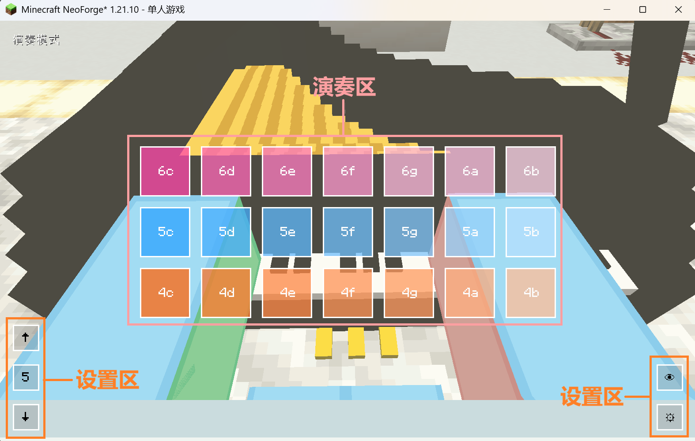
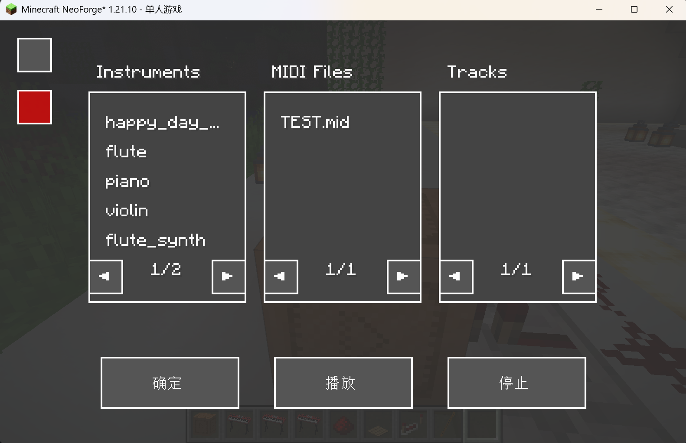

我的音乐幻想|MineFantasia
=======

  <strong>语言</strong>: <a href="README-en.md">English</a> | <a href="README.md">简体中文</a>

介绍
=======
欢迎来到我的音乐幻想！这是一个我的世界音乐模组。

模组目前仍处于开发期，但你可以下载模组体验当前开发完成的功能。

模组提供了钢琴、合成器、弦乐、管乐等各种乐器。只需要右键对应的乐器，你就可以在打开的新界面中使用键盘或鼠标开始乐器的演奏了。

除了乐器，模组也提供了多人共同演奏系统。这意味着你可以与你的好友一同演奏一场华丽的乐器合奏。

乐器演奏系统
=======
模组向我的世界中添加了乐器演奏系统，并基于此添加了非常多种类的乐器。这也是此模组实现的核心功能。

## 乐器演奏界面

在玩家右手手持乐器/对着已放置的乐器右键时，会打开乐器演奏界面：

`演奏区`：包含21个方块，从上到下，从左到右，每个方块映射的键盘按键为Q-U，A-J，Z-M，中间有当前方块对应的音的名称。

`设置区`：包含5个功能按钮，左下角三个，右下角两个。

### 界面左下角：

有3个按钮，从上到下依次为：`升高按钮`、`当前中心音组编号`/`升高的半音数`、`降低按钮`。

当中间的按钮显示没有`+`、`-`号时，显示`当前中心音组编号`，有`+`、`-`号时，显示`升高的半音数`。二者的记录相互独立但也互相作用，在单次演奏周期内只会分开记录各自数据，但不会因切换而重置。

当你在显示`中心音组编号`的模式下点击`升高/降低按钮`，`演奏区`21个音整体将向上提高/降低一个`8度`，即12个半音。在显示`升高的半音数`的模式下点击`升高/降低按钮`，21个音将整体向上升高/降低一个`半音`。所有改动都会显示在演奏区方块中。

需要注意的是：在`中心音组编号`的模式下，音高升高/降低幅度不会超过/低于记录的乐器的最高音组编号；而在显示`升高的半音数`的模式下，为了保证涵盖所有的音符，其上限和下限均扩大了1个音组。

这三个按钮绑定键盘上的上下左右键。上键为`升高按钮`，下键为`降低按钮`，右键为从`当前中心音组编号`切换为`升高的半音数`，左键为`从升高的半音数`切换为`当前中心音组编号`。

### 界面右下角：

有2个按钮，从上到下依次为：`隐藏演奏方块按钮`（带有一个眼睛图标）和`设置按钮`（带有一个齿轮图标）。

点击`隐藏演奏方块按钮`时，`演奏区`的21个方块和`设置按钮`会被隐藏，演奏界面背景变为全透明，再次点击复现。

点击`设置按钮`时，进入`音符编辑模式`，可以通过键盘或鼠标选中需要改变音名的方块，在下方输入框中输入新的音名，`回车`即可完成修改。

## 音符设定

由于原版Minecraft注册系统的限制，音符名称的命名规则为：`音组编号（八度音程位置） + 音名`。

`音组编号`参考的是FL Studio中钢琴卷帘的编号，音名均为小写字母，音名前用`s`代表`#`。如`5c`、`6sc`等。模组没有引入降号音符。

文件系统和自定义玩家模型
=======
为了让模组的乐器演奏系统更加生动，也为了适配乐器演奏动画，模组添加了基于GeckoLib5的动画系统，并基于最新的GeckoLib5，替换了原版Minecraft中所有视角的玩家模型。在你演奏乐器的过程中，模型也会做出对应的演奏动作。

模组也重新设计了一套第一人称视角下相机的跟随系统。虽然这套系统在快速左右视角移动和极个别状态下的表现还有待加强，但在大多数情况下这套系统能够实现真正的玩家第一视角并保持良好的运作效果。

模型支持替换，但ysm模型或其它模组的模型在此模组中<strong>_不受支持_</strong>。你应该使用GeckoLib模型。

在你初次运行模组并进入世界后，模组会在你的`mods`文件夹下生成模组的专属文件夹。

其文件结构为： 

 点击展开

📁`minefantasia` 
├──📁`midi` 
├──📁`model` 
│ ├──📄`player.geo.json` 
├──📁`animation` 
│ ├──📄`player.animation.json` 
├──📁`texture` 
│ └──🖼️`player.png` 
└──📄`uuid.json` 

其中，`model`文件夹存放你所有的GeckoLib模型文件`key.geo.json`，`midi`文件夹存放你所有的midi文件（与模型替换无关），`animation`文件夹存放你所有的GeckoLib模型动画文件`key.animation.json`，
`texture`文件夹存放你所有的GeckoLib模型贴图`key.png`。

除`midi`文件夹外，每个目录都将生成一个以`player`为`key`的默认JSON文件，你不应该移除或替换它们。

`uuid.json`文件是一个以玩家uuid命名的文件，只在玩家进入世界时生成，其内容含有四个关键记录字段： 

 点击展开

📄`uuid.json` 
├── 🗝️`key`字段：玩家使用的模型的关键字，用于在模组代码中注册、标记和绑定对应玩家模型的id，不同玩家可以使用同一个key。 
├── 🗝️`model`字段：自定义GeckoLib玩家模型文件的绝对路径，<strong>不需要</strong>加上`.geo.json`后缀。 
├── 🗝️`texture`字段：自定义玩家GeckoLib玩家模型贴图的绝对路径，需要完整的文件名称。 
└── 🗝️`animation`字段: 自定义GeckoLib玩家模型动画文件的绝对路径，<strong>不需要</strong>加上`.animation.json`后缀. 

为了便于模组内部进行模型注册和区分，所有模型文件的文件名和骨骼需要加上你的模型`key`作为前缀，如：`key.geo.json`，`key.head`等。

模组对模型骨骼数量及其结构并没有特别严格的规定和限制，但请确保在你的自定义GeckoLib模型中包含符合如下要求的重要骨骼： 

 点击展开

📄`key.geo.json` 
├── 🦴`key.head`骨骼：此骨骼用于模组内部计算第一人称视角下相机的坐标及偏移；同时定位模型头部位置并进行头部随视角旋转的计算。 
├── 🦴`key.cameraAnchor`骨骼：此骨骼下只能为一个定位器（`locator`），定位器的名称<strong>必须</strong>为cameraAnchor，其父类建议为模型根骨骼（`key.root`）或头部骨骼（`key.head`）。此骨骼用于模组计算第一人称视角下的相机坐标及偏移。 
├── 🦴`key.rightHandItem`骨骼：此骨骼下只能为一个定位器（`locator`），定位器的名称<strong>必须</strong>为rightHandItem,其父类需为对应手部骨骼，以允许物品随动画而移动。此骨骼用于模组内部计算所有视角下玩家右手（主手）物品的渲染位置和偏移。 
└── 🦴`key.leftHandItem`骨骼：此骨骼下只能为一个定位器（`locator`），定位器的名称<strong>必须</strong>为leftHandItem,其父类需为对应手部骨骼，以允许物品随动画而移动。此骨骼用于模组内部计算所有视角下玩家左手（副手）物品的渲染位置和偏移。 

模组使用以上4个骨骼的`pivot`用于坐标计算，请确保它们的pivot数值正确。 
对于除以上4个骨骼以外的其它骨骼及它们的子骨骼、骨骼内的元素名称等，模组并没有严格限制。

需要注意的是，模组目前的玩家模型替换系统在多人游戏下并不会自动同步各个玩家正在使用的模型，且依然需要手动调整`uuid.json`中的内容来进行模型的更换。这意味着如果你想向其他人展示自己的模型，你需要将你的模型的所有json文件发送给他们，并通知他们手动修改<strong>他们设备上的</strong>对应的你的`uuid.json`。

自定义模型动画
=======
模组支持自定义玩家模型动画。由于所有动画名称硬编码在模组代码中，所以你的自定义模型动画名称需与模组编码的动画名称相同。 
当前支持的动画及其命名要求如下： 

 点击展开

📄`key.animation.json` 
├── 🎬`key.walk`：玩家模型在行走时播放的动画。 
├── 🎬`key.idle`：玩家模型在静止时播放的动画。 
├── 🎬`key.crouch`：玩家模型在潜行时播放的动画。 
├── 🎬`key.swim`：玩家模型在游泳时播放的动画。此动画播放时不会显示玩家手持物品。由于原版Minecraft会在此种情况下将玩家的碰撞箱大小改为`0.6x0.6x0.6`，为了让玩家模型的头部能够正常旋转并正确应用camera坐标，在制作此动画时，请在模型整体动画完成后，在BlockBench的`动画`页面通过移动整体模型(`key.root`)，将模型头部骨骼`key.head`的`pivot`对齐至坐标`[0, 6.4, 0]`处，并且保证`key.root`骨骼<strong>没有</strong>`旋转偏移`（`Rotation`）。 
├── 🎬`key.fly`：玩家模型在使用鞘翅飞行时播放的动画。此动画播放时不会显示玩家手持物品。由于原版Minecraft会在此种情况下将玩家的碰撞箱大小改为`0.6x0.6x0.6`，为了让玩家模型的头部能够正常旋转并正确应用camera坐标，在制作此动画时，请在模型整体动画完成后，在BlockBench的`动画`页面通过移动整体模型(`key.root`)，将模型头部骨骼`key.head`的`pivot`对齐至坐标`[0, 6.4, 0]`处，并且保证`key.root`骨骼<strong>没有</strong>`旋转偏移`（`Rotation`）。 
├── 🎬`key.piano`：玩家模型在使用钢琴进行演奏时播放的整体动画，如姿势改变。 
├── 🎬`key.kalimba`：玩家模型在使用卡林巴琴进行演奏时播放的整体动画，如姿势改变。 
├── 🎬`key.harp`：玩家模型在使用竖琴进行演奏时播放的整体动画，如姿势改变。 
├── 🎬`key.violin`：玩家模型在使用小提琴进行演奏时播放的整体动画，如姿势改变。 
├── 🎬`key.synth`：玩家模型在使用所有种类的合成器演奏时播放的整体动画，如姿势改变。 
├── 🎬`key.pianoPlay`：玩家模型在使用钢琴演奏并进入演奏界面，按下音符时触发的瞬时动画，如手部动作。 
├── 🎬`key.kalimbaPlay`：玩家模型在使用卡林巴琴演奏并进入演奏界面，按下音符时触发的瞬时动画，如手部动作。 
├── 🎬`key.harpPlay`：玩家模型在使用竖琴演奏并进入演奏界面，按下音符时触发的瞬时动画，如手部动作。 
├── 🎬`key.violinPlay`：玩家模型在使用小提琴演奏并进入演奏界面，按下音符时触发的瞬时动画，如手部动作。 
├── 🎬`key.synthPlay`：玩家模型在使用合成器演奏并进入演奏界面，按下音符时触发的瞬时动画，如手部动作。 
└──

补充说明：对于`key.swim`和`key.fly`两个动画不能修改`key.root`骨骼的`旋转偏移`（`Rotation`）的原因：在实践中，如果添加基于模型根骨骼的旋转偏移，GeckoLib对玩家头部骨骼随视角的旋转运算会出现偏差甚至失效。当前具体原因尚不明确，因此暂时只能在动画制作过程中避免直接修改根骨骼的旋转偏移。

由于个人美术技术力有限，默认模型在演奏某些乐器时不会有演奏动画，因此也没有进行详尽的测试验证，但是模组依然保留了这些动画的相关调用。你可以在替换的模型中使用上面提到的动画名称来添加替换演奏对应乐器时的动画。如果出现任何问题，可前往此模组的[GitHub仓库的issues页面](https://github.com/Seikai-Takenawa/MineFantasia/issues)发布issue。

MIDI系统
=======
模组实现了本地MIDI文件的读取，并可以使用模组内部的乐器音色进行播放。

所有的midi文件均存放于`mods/minefantasia/midi`文件夹下： 

 点击展开

📁`minefantasia` 
└──📁`midi` 

MIDI文件的后缀名需为`.mid`，模组支持`format0`、`format1`的MIDI文件的单轨、多轨道同时播放；`format2`的midi文件的单轨播放。

## MIDI播放器及其界面

在模组中，MIDI文件的播放通过模组方块实体：MIDI播放器实现。其界面如下图所示：

MIDI播放器界面有三个选择栏目，从左到右分别为：

### Instruments

此栏目会默认将模组的所有乐器显示出来。在此栏目中，你可以选择播放音轨所要使用的模组乐器。此栏目一次只能选择一个乐器。

### MIDI Files

此栏目会自动读取你存放在`mods/minefantasia/midi`文件夹下的所有MIDI文件的名称并显示出来。在此栏目中，你可以选择需要播放的MIDI文件。在选择后，模组会自动解析MIDI文件并将MIDI文件的所有轨道依次显示在`Tracks`栏目。此栏目一次只能选择一个MIDI文件。

### Tracks

此栏目在你选定一个MIDI文件后，会读取选定的MIDI文件并将此MIDI文件中的所有的轨道依次显示出来。在此栏目中，你可以一次选择多个轨道。

每个栏目下方都有左右箭头指示的翻页键。所有栏目的默认显示信息条数均为5条。

与此同时，MIDI播放器界面还有三个按钮，从左到右依次为:

### 确定
此按钮专门用于红石信号触发前的信息设定，如设置演奏乐器和演奏轨道等。在未播放的情况下，点击此按钮并不会播放所选轨道。如需要播放，可使用红石信号触发。而在正在播放的情况下，点击此按钮，系统会检查此时乐器选择等选项是否改变，若改变，则会停止播放，并立刻开始用新的配置播放。

### 播放
此按钮用于在选定演奏乐器和轨道后，立即播放所选的轨道。

请注意：如果没有选任何乐器、轨道就点击播放，MIDI播放器会将相关信息设置为空。

### 停止
此按钮用于立即停止当前MIDI播放器的播放，并清空之前的演奏乐器、演奏轨道等播放信息。如果不点击此按钮，在midi序列正常播放结束后，其信息不会丢失。点击此按钮后，需要重新设定MIDI播放器。

在界面的左上角还有两个按钮，从上到下分别是：

### 网络同步播放按钮
此按钮激活时，按钮显示为绿色，并将向全服玩家播放当前正在播放的MIDI文件。此同步功能在各个客户端中独立。这意味着：即使其它玩家没有你所持有的MIDI文件，也能够听到音乐。此按钮支持在播放中随时调整。

### 结束控制按钮
此按钮默认显示为红色，表示当前播放器实体已被你占用。点击此按钮，你失去对此播放器实体的占有，播放界面将关闭，此时其它玩家可以右键打开播放界面并使用此播放器。

## MIDI播放器的控制

MIDI播放器支持使用红石控制，其与普通方块一样可以传递红石信号，但其本身并非红石方块。

MIDI播放器接收红石脉冲信号，在接收到一次脉冲信号后，会改变一次播放状态。

单个MIDI播放器在多人游戏模式下全服共用一个实体。为此，为了避免不同客户端使用冲突，MIDI播放器添加了玩家绑定。在初次放置后，会自动绑定首次打开播放界面的玩家。
在此玩家主动释放或方块被破坏并重新放置前，服务器内的其它玩家均无法右键打开播放界面，但是依然可以通过红石控制播放器的播放状态。

安装
=======
1.请前往GeckoLib的[GitHub仓库](https://github.com/bernie-g/geckolib)、[modrinth](https://modrinth.com/mod/geckolib)等位置下载GeckoLib-NeoForge对应版本，并将下载的jar包放入你的'mods'文件夹下。 
2.请于右侧的release或modrinth等位置下载本模组的最新版本，并将下载的jar包放入你的'mods'文件夹下。 

常见问题
=======
Q1.我该如何获取乐器？ 
A1.目前，乐器暂不支持合成和制造。非创造模式下，模组的钢琴自然生成于模组结构`音乐厅`（`Concert Hall`）的中心位置且不可破坏，
其它的乐器仅能够在音乐厅的后台箱子里随机获取。 

Q2.在多人游戏下，我没法听到其它玩家演奏乐器的声音。 
A2.多人游戏下，乐器演奏系统只会将演奏信息同步到与正在演奏乐器的那一位玩家处于同一区块内的玩家。 

Q3.我在第一人称视角下能够穿过方块进行透视。 
A3.模组重构了第一人称视角下相机的跟随系统，现在相机会始终位于玩家模型头部的`cameraAnchor`处，所以在玩家紧靠面前方块向下看时，可能会出现相机位置超出玩家碰撞箱的情况，进而导致透视问题。除此之外，建模师错误的配置`cameraAnchor`骨骼的`pivot`也可能会导致相机坐标超出玩家碰撞箱的问题。目前此问题暂无更好的解决方案，建议替换的玩家模型头部设计小巧一些，并调整头部及cameraAnchor骨骼的`pivot`到合适位置，以避免头部活动时超出玩家碰撞箱。 

Q4.各个视角下玩家手部显示某些物品的大小、角度等很奇怪。 
A4.由于替换了整个原版的玩家模型系统，使得原版的物品渲染逻辑已经不再适用于替换的GeckoLib模型。此问题正在进行适配和改善。 

Q5.MIDI播放器速度不对/卡顿/变快。 
A5.由于模组使用我的世界内置tick系统计时，其精准度受到服务端/客户端的tick值波动的影响。

Q6.将来会有Forge/Fabric端的模组吗？ 
A6.个人开发精力有限，暂没有Forge/Fabric端的开发计划。

Q7.我如何获取源码向模组中添加自定义的乐器和功能？ 
A7.模组暂不开源，敬请谅解！
